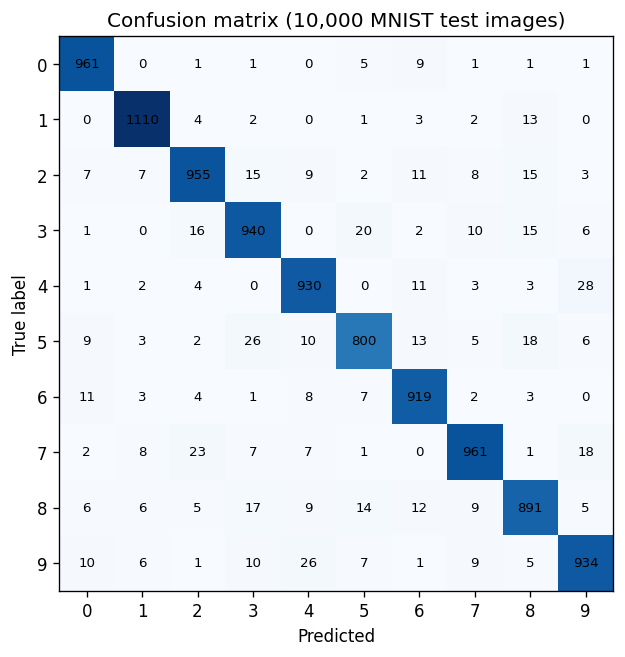
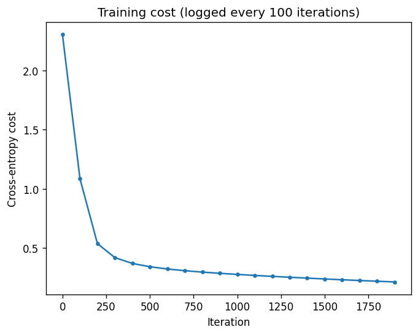

# Digit recognition

> MNIST digits two ways: a neural network written from scratch in NumPy, and a PyTorch CNN. Draw a digit in the Streamlit demo and see the prediction.

## Why

Writing forward pass, backpropagation and gradient descent by hand is the best way to understand what a framework does for you. Training a CNN on the same task then shows what convolutions bring.

## Approach

| | NumPy MLP (`numpy_mlp.py`) | PyTorch CNN (`cnn.py`) |
|---|---|---|
| Architecture | 784 - 64 - 10, ReLU, softmax | 2 conv layers (32, 64) + max-pool + dropout, FC 128, FC 10 |
| Training | full-batch gradient descent, lr 0.1, 2000 iterations | Adam, lr 1e-3, batch 64, 10 epochs |
| Model selection | none (fixed schedule) | best epoch on a 6k validation split, test set used once |
| Test accuracy | **94.0 %** | **about 99 %** |

The NumPy version checks its gradients against finite differences (see `tests/`).

## Results

NumPy MLP on the 10,000 MNIST test images: accuracy 0.9401, macro precision 0.9395, macro recall 0.9393, macro F1 0.9393. The most frequent confusions are 4 predicted as 9 (28 cases), 5 as 3 (26), 9 as 4 (26) and 7 as 2 (23).




The CNN reached about 99 % test accuracy after 5 epochs on CPU. `python cnn.py train` prints the exact figure for your run.

## Run

```bash
python -m venv .venv && source .venv/bin/activate
pip install -r requirements.txt

python numpy_mlp.py                # train the MLP, write artifacts/ and assets/
python cnn.py train                # train the CNN (checkpoint in checkpoints/, git-ignored)
python cnn.py predict digit.png    # white digit on black background

pip install -r requirements-app.txt
streamlit run app.py               # draw a digit, get a prediction
```

MNIST is downloaded to `data/` (git-ignored) on first use.

## Tests

```bash
pip install pytest
python -m pytest
```

## Notes

- The MLP metrics, confusion matrix and cost curve above come from the original training run of this network, done in a notebook. `python numpy_mlp.py` regenerates them from the scripts.
- Digits drawn on the canvas are thinner and less centred than MNIST samples, so the demo is less accurate than the test set suggests.
- `artifacts/digit_mlp.npz` holds the trained MLP weights (400 KB) so the demo works without training. It is a plain `.npz`, not a pickle.
- Data: MNIST, LeCun, Cortes and Burges.
