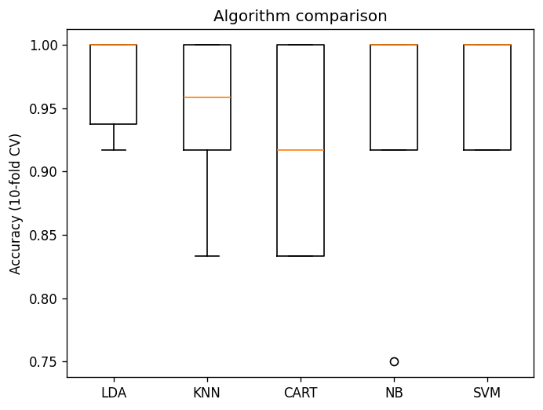
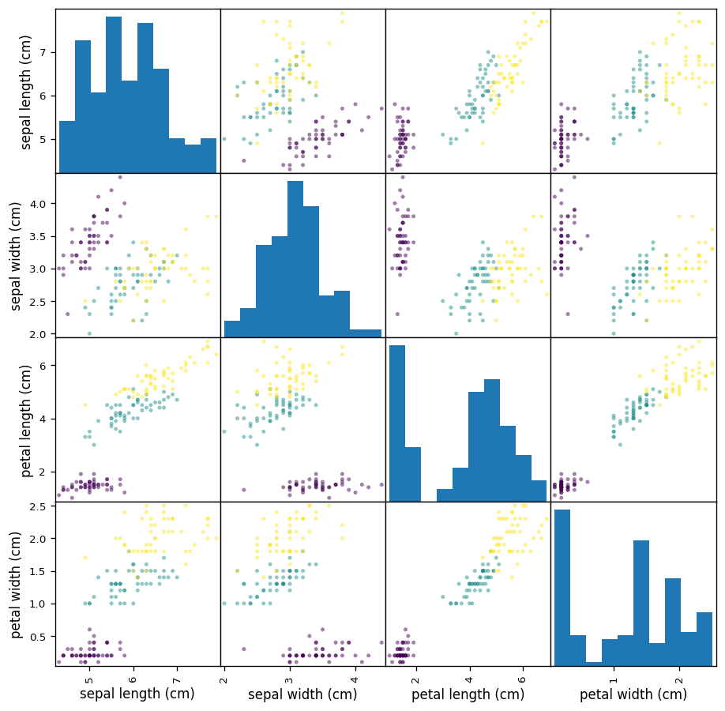

# Iris classification

> Compare five classic classifiers on Iris with stratified cross-validation, then check the winner once on held-out data.

## Why

A compact, reproducible template for the standard model-selection workflow: never pick a model on the data you report on. It follows the first-project workflow popularised by Machine Learning Mastery, rebuilt with a fixed seed, stratified splits and figures written to disk.

## Approach

- **Data:** the 150-sample Iris dataset bundled with scikit-learn (no download).
- **Split:** 80 % training (120 samples), 20 % held out (30 samples), stratified by species.
- **Candidates:** LDA, k-NN, decision tree (CART), Gaussian Naive Bayes, SVM (RBF).
- **Selection:** stratified 10-fold cross-validation on the training split, best mean accuracy wins.
- **Final check:** the winner is fitted on the training split and scored once on the held-out split.

## Results

| Model | CV accuracy (mean ± std) |
|---|---|
| **LDA** | **0.975 ± 0.038** |
| SVM | 0.967 ± 0.041 |
| k-NN | 0.950 ± 0.055 |
| Naive Bayes | 0.950 ± 0.076 |
| CART | 0.917 ± 0.075 |

LDA scores 30/30 on the held-out split. With 30 samples and fold-to-fold standard deviations around 0.04, LDA, SVM and k-NN cannot be separated reliably: the ranking is indicative, not conclusive.




## Run

```bash
python -m venv .venv && source .venv/bin/activate
pip install -r requirements.txt
python main.py
```

## Tests

```bash
pip install pytest
python -m pytest
```

## Notes

- Iris: Fisher (1936), distributed with scikit-learn.
- Next steps: repeated cross-validation to tighten the comparison, hyperparameter search per model.
