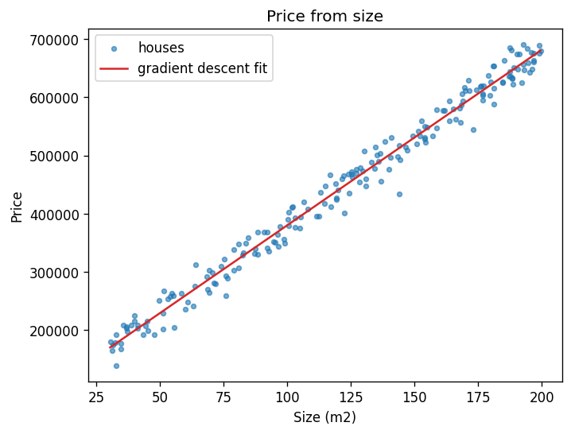
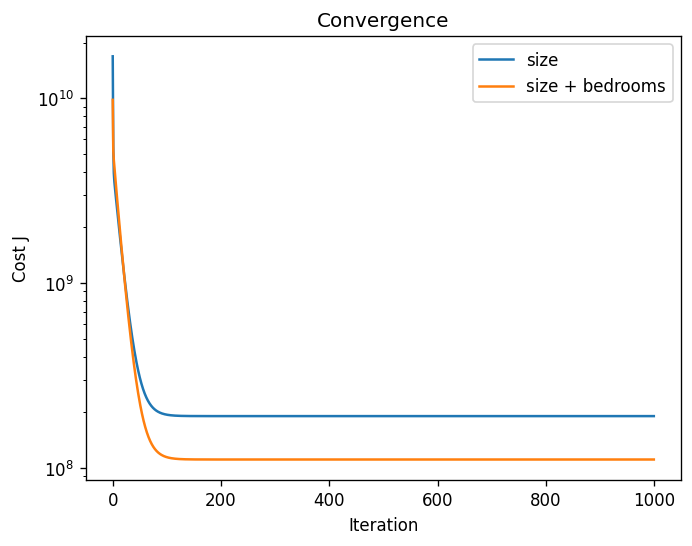

# Linear regression from scratch

> Batch gradient descent in plain NumPy, on a single feature and on two, checked against the closed-form least-squares solution.

## Why

Gradient descent is the engine behind almost every model trained today. Implementing it on the simplest model, where the exact answer is known, shows both how it works and how to verify an optimiser.

## Approach

- **Model:** `y_hat = X @ theta` with a bias column. Cost `J = 1/(2m) * sum((X @ theta - y)^2)`, update `theta <- theta - lr/m * X.T @ (X @ theta - y)`.
- **Data:** 200 synthetic houses, `price = 50,000 + 3,000 x size + 10,000 x bedrooms + noise (sigma 15,000)`. Synthetic data means the true relationship is known.
- **Preprocessing:** min-max scaling of the features so that a single learning rate (0.5) works for all of them.
- **Check:** the fitted `theta` is compared with `np.linalg.lstsq`.

## Results

| Fit | R2 | Match with the normal equation |
|---|---|---|
| price ~ size | 0.984 | identical to the nearest unit |
| price ~ size + bedrooms | 0.991 | identical to the nearest unit |

Both fits converge in about 150 iterations at learning rate 0.5.




## Run

```bash
python -m venv .venv && source .venv/bin/activate
pip install -r requirements.txt
python main.py
```

## Tests

```bash
pip install pytest
python -m pytest
```

The tests check the scaler, the cost function, and that gradient descent reproduces the normal-equation solution.

## Notes

- Thetas are expressed in scaled feature space, which is why the size coefficient (about 510,000) is the price change over the whole size range, not per square metre.
- Next steps: stochastic and mini-batch variants, L2 regularisation, learning-rate schedules.
