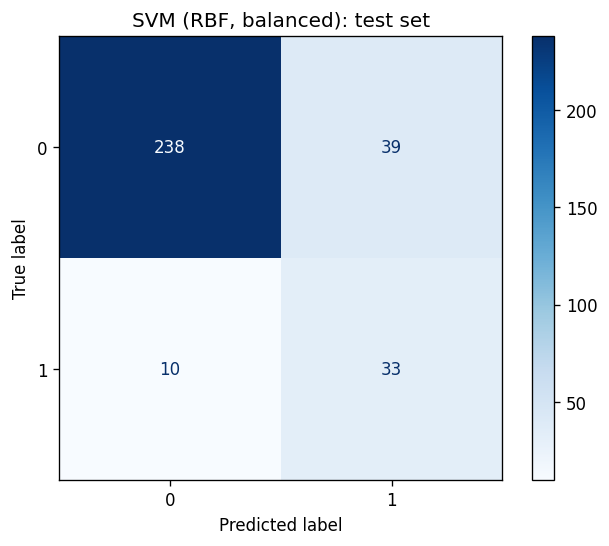

# Wine quality classification

> Predict whether a red wine is "good" (quality 7 or more) from its physicochemical measurements, on a dataset where only about 14 % of wines qualify.

## Why

About 86 % of the wines are in the majority class, so a model that always answers "not good" is already 86.6 % accurate on the test split. This project makes the point concrete: it compares models on precision, recall and F1 of the rare class, and shows what class weighting buys.

## Approach

- **Data:** UCI Wine Quality, red wines, 1,599 samples, 11 features, no missing values. Downloaded to `data/` on first run.
- **Target:** `quality >= 7`, stratified 80/20 split (320 test samples, 43 of them good wines).
- **Models:** logistic regression, ridge classifier, SGD classifier and RBF SVM, each behind a `StandardScaler`, plus class-weighted variants of logistic regression and SVM.
- **Outliers:** flagged with Tukey's rule (up to 9.7 % of rows for residual sugar) but kept: they are real measurements and the target class is rare.

## Results

Metrics on the test set, positive class = good wine (scikit-learn 1.8, seeds fixed):

| Model | Accuracy | Precision | Recall | F1 |
|---|---|---|---|---|
| **SVM (RBF, balanced)** | 0.847 | 0.458 | 0.767 | **0.574** |
| Logistic regression (balanced) | 0.812 | 0.400 | 0.791 | 0.531 |
| SVM (RBF) | 0.900 | 0.762 | 0.372 | 0.500 |
| SGD classifier | 0.869 | 0.513 | 0.465 | 0.488 |
| Logistic regression | 0.894 | 0.696 | 0.372 | 0.485 |
| Ridge classifier | 0.869 | 0.571 | 0.093 | 0.160 |

The best plain accuracy (0.900) is barely above the 0.866 baseline. For the SVM, class weighting gives up 5 points of accuracy to find about twice as many good wines (recall 0.77 against 0.37). Which trade-off is right depends on the cost of missing a good wine versus flagging a mediocre one. With only 43 positive test samples, each wine moves recall by 2.3 points, so small differences between models are noise.



## Run

```bash
python -m venv .venv && source .venv/bin/activate
pip install -r requirements.txt
python main.py
```

If the automatic download fails, save the red wine CSV from the UCI repository as `data/winequality-red.csv` (semicolon-separated).

## Tests

```bash
pip install pytest
python -m pytest
```

The tests use synthetic data and need no download.

## Notes

- Data: P. Cortez, A. Cerdeira, F. Almeida, T. Matos and J. Reis, *Modeling wine preferences by data mining from physicochemical properties*, Decision Support Systems 47(4), 2009.
- Next steps: cross-validated threshold tuning on predicted probabilities, precision-recall curves, gradient boosting.
